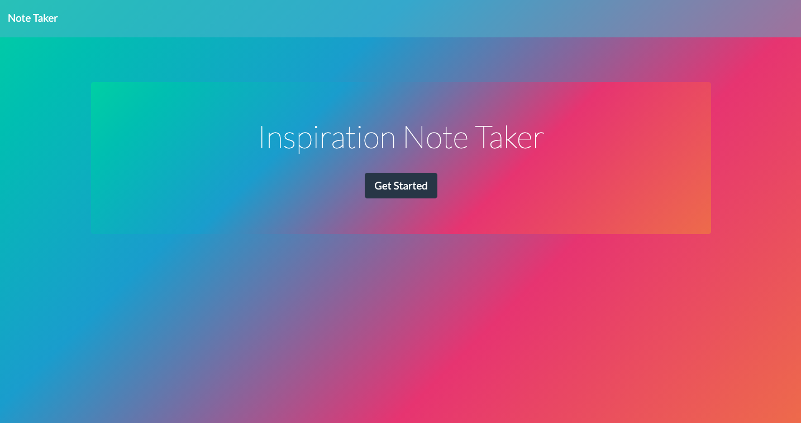
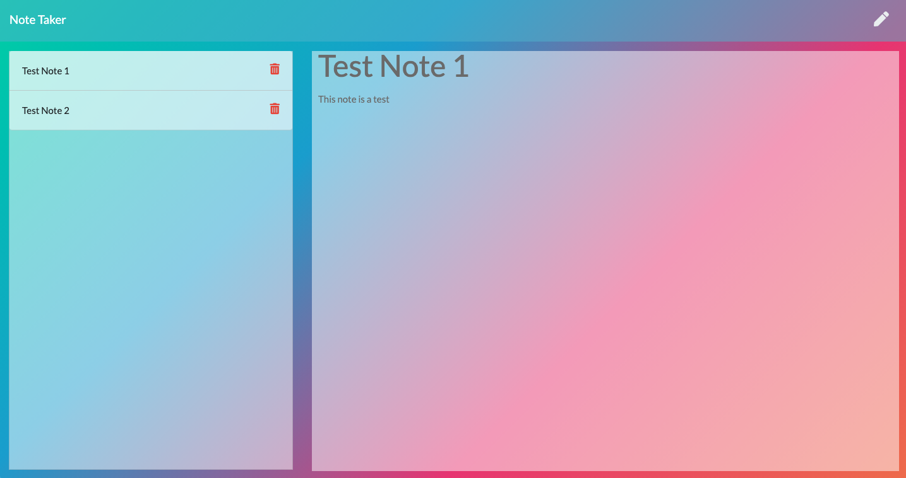

# Inspiration Note Taker 

## Table Of Contents

1. [License](#license)

2. [Description](#description)

3. [Usage](#usage)

4. [Questions](#questions)

## Description

This application will be used to create and delete notes any time the inspiration is coming and there is an access to the internet.

## Usage

By pushing the edit icon from the top right corner, you open note creator section. To save the note, there will appear a save button near the edit icon which will save the note on the left side of the screen. Lastly, to delete the note there is a trash button on each note.

## Questions

My GitHub profile: [https://github.com/paveldarii](https://github.com/paveldarii).

My email address: paveldarii@yahoo.com

## License

[The MIT License](https://opensource.org/licenses/MIT/)
